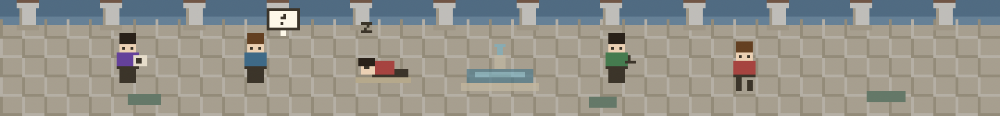

# Agore

**Agora + Agent** — 让所有 coding agent 聚集、彼此可见的数字广场。

Agore is a macOS menu bar companion that turns the coding agents working on your machine
into pixel people milling about a Greek plaza. When an agent reads a file it sits down with
a scroll; when it runs a command it paces around; when nothing is running, the plaza's
caretaker takes a nap by the fountain.



The strip is translucent and can be pinned above every window, so the plaza stays in the
corner of your eye while you work.

## Status

Cursor and [opencode](https://opencode.ai) both walk onto the plaza, each as its own pixel
person: one figure per client and agent, so a Mac running both shows two. A Go plaza server
can broadcast those people to every other client over WebSocket.

## Requirements

- macOS 14 or later
- Xcode command line tools (`xcodebuild`)
- At least one agent, for there to be anything to watch:
  - [Cursor](https://cursor.com) with user hooks support
  - [opencode](https://opencode.ai), which loads plugins from its config directory
- Python 3 (ships with macOS) for the Cursor hook forwarder and the build scripts

## Getting started

```bash
make build     # compile the app (Debug)
make release   # optimized Release build
make run       # (re)launch the Debug build
make run-release
make test      # run the unit tests
```

`make build` and `make run` default to Debug. Pass `CONFIGURATION=Release` to either, or use
the `release` / `run-release` targets. The binary lands at
`build/DerivedData/Build/Products/<Debug|Release>/Agore.app`.

On first launch Agore sits in the menu bar and wires itself into whichever agents it finds
on the Mac: a hook in `~/.cursor/hooks.json` for Cursor, a plugin in
`~/.config/opencode/plugins/` for opencode. The square courtyard opens from a Dock click
or **Agore → Show Plaza** (⌘0). Both agents need to be restarted once for a freshly
installed bridge to take effect, and an agent installed later gets picked up within half
a minute.

Agents Agore cannot find are left alone rather than having a config directory created for
them. If yours lives somewhere unusual, install it by hand from **Agents** in the status
item menu.

### Using it

- **Left-click** the menu bar icon: show or hide the floating strip
- **Dock click** or **Agore → Show Plaza** (⌘0): open the square courtyard window
- **Right-click** (or Control-click): **Style**, **Opacity**, **Always on Top**, nickname, plaza token, show/hide, **Agents**, quit
- **Opacity** defaults to 80% and can be dragged live from the status item or **View → Opacity**; Agore remembers it across launches
- **Hover** a pixel person: their name spells itself out in full
- **Drag** the strip anywhere; Agore remembers where you put it
- With **Always on Top** enabled the plaza joins every Space, survives clicks elsewhere, and
  comes back automatically on the next launch

The bar along the bottom shows how many people are on the plaza (your own agents included,
one each), what this Mac as a whole is up to, which agents are wired up
(`cursor on · opencode off`), and when the last event arrived. On the strip it stays
hidden until the pointer rests on the bottom edge, so the plaza can use the full card;
the courtyard window keeps it in view.

### Styles

Four worlds, picked from **Style** in the status item menu or **View → Style** in the menu
bar, and remembered across launches:

| Style | The plaza is | You are |
| --- | --- | --- |
| Greek Agora | Marble paving under a colonnade, a fountain, olive trees, stone benches | A pixel person, with a couple of stray cats loafing about |
| Sunny Seaside | A beach under a big sky, surf and a bay, palms, a parasol, beach towels | A pixel cat, a different coat for each agent |
| Antonovka Stop | A country road through sunflowers, a bus shelter under a wide sky | A pixel rabbit, a different outfit for each agent |
| Koriko Sky | Open blue sky, a clock tower, scattered drifting clouds | A witch girl in a pointed hat, flying a broom |

All four keep the same daylight cycle and read the same activity; only the inhabitants change,
so a cat, a rabbit or a witch sits, hops or flies about and curls up asleep wherever a person
would have stood, strolled and lain down. Switching styles repaints the plaza and everyone walks back in.

### What the pixel people are doing

| On screen | Activity | Comes from |
| --- | --- | --- |
| Sitting with a scroll | reading | `Read`, `Grep`, `Glob`, `WebSearch`, opencode's `read`, `list`, … |
| Scribbling | writing | `Write`, `StrReplace`, `afterFileEdit`, opencode's `edit`, `patch`, … |
| Pacing the plaza | running | `Shell`, `Task`, MCP calls, `beforeShellExecution`, opencode's `bash`, … |
| Strolling, head down | thinking | `afterAgentThought`, a finished tool call, anything unrecognised |
| Standing with a bubble | waiting | `stop`, `sessionStart`, `session.created`, `permission.asked`, a user turn |
| Asleep on a bench or towel, dimmed | idle | `sessionEnd`, `session.idle`, or two minutes of silence with no tool call open |
| Walking out through a gate | gone | that client disconnected from the plaza |

Tool names are matched case-insensitively, because Cursor spells them `Read` and opencode
spells them `read`.

One pixel person — or one cat, or one rabbit, or one witch — per client *and agent*, not per conversation: a Mac running
Cursor and opencode side by side puts two of them on the plaza, named `wade-cs` and
`wade-oc` after your nickname (default: this Mac's hostname) and which agent each one is.
A name has to stay narrow enough to read the people either side of it, so the agent is a
two-letter tag and a nickname over ten letters is cut: `wadelingsb…-cs`. **Hover** a person
to see the whole of it, `wadelingsbigmac-cursor`. Each is on the plaza
from the moment Agore is wired into that agent, resting until it wakes up. One agent's
conversations and subagents still share a figure, folded into a single pose: running beats
writing, which beats reading, and so on. Up to eight people hold distinct spots around the
fountain; beyond that the plaza fills a second row.

## How it works

```
Cursor agent                      opencode agent
   │  user hook                      │  plugin
   │  (~/.cursor/hooks.json)         │  (~/.config/opencode/plugins/agore.js)
   ▼                                 ▼
agore-forward.sh                   agore.js
   └──────────────POST──────────────┘
                    │
                    ▼
   127.0.0.1:<random port>/events   (loopback only)
                    │
      ActivityMapper → PresenceStore (1 person per agent)
                    │
    ┌───────────────┴───────────────┐
    ▼                               ▼
SpriteKit plaza          WebSocket hello/presence
                                  │
                           Go plaza server :8081
                                  │
                           broadcast to all clients
```

- **Both agents speak the same JSON.** Whichever bridge sent it, an event is the same handful
  of fields posted to a loopback HTTP listener inside the app. The port is random per launch
  and written to `~/Library/Application Support/Agore/ingest.port`; both forwarders read it
  from there and stay quiet when it is missing.
- **Neither bridge can get in the agent's way.** The Cursor script has a 0.4s timeout and
  always exits 0. The opencode plugin never awaits its own POST and swallows every error,
  because throwing from `tool.execute.before` would block the tool it is reporting on.
- **Transcript scanning is the fallback, for Cursor.** Every 30 seconds Agore checks the
  modification time of Cursor's local transcript files under
  `~/.cursor/projects/*/agent-transcripts/`, which covers cold starts and sessions that began
  before the hook was installed. opencode needs no equivalent: it loads the plugin at startup,
  so there is no window in which a session runs unobserved.
- **Activity expires on a clock, membership does not.** Two minutes of silence sits an agent
  down to rest, but standing on the plaza is about being connected: people only walk out once
  the server drops them from the roster, which it does for all of a client's people at once
  when the socket closes, and for one of them when Agore is unwired from that agent.
- **An open tool call holds the clock.** Both agents go quiet for the whole duration of a
  tool, so a long test command would otherwise look the same as an agent that quit. Agore
  pairs each `preToolUse` with its `postToolUse` — and `tool.execute.before` with
  `tool.execute.after`, and the shell and MCP hooks with their counterparts — and keeps the
  person on stage until the call reports back, up to thirty minutes.
- **opencode's MCP calls are the one blind spot.** opencode does not fire its tool hooks for
  MCP tools, so an agent working through one looks like it is thinking rather than running.

### Privacy

Agore is built to know *that* an agent is working, not *what* it is working on. Both
bridges send only the conversation or session id, the event name, the tool name, the opaque
tool call id, and the last path component of the workspace folder. Prompts, file contents,
shell commands and their output, diffs, and full paths never leave the agent — the opencode
plugin reads a tool call's name and ignores its arguments entirely. The local
database (`~/Library/Application Support/Agore/presence.sqlite`) stores the same narrow set
and prunes itself after seven days. The local hook listener binds to loopback only.

The shared plaza server sees even less: `client_id`, `member_id` (the client id plus which
agent it stands for), nickname, activity kind, and the current project folder name. The
nickname travels on its own; pairing it with the agent for the label is something each
client does when it draws. A shared `AGORE_TOKEN` is required to join. Conversation ids
never leave the Mac.

## Project layout

```
Apps/Agore/                  AppKit shell: status item, floating panel, onboarding window
Sources/AgoreCore/           presence model, activity mapping, bridge install, SQLite store
Sources/AgoreCore/Ingest/    the loopback listener both agents post to
Sources/AgoreCore/Cursor/    hooks.json install, transcript fallback
Sources/AgoreCore/Opencode/  plugin install
Sources/AgorePlaza/          pixel art, styles, SpriteKit scene, character behaviour
server/                      Go WebSocket plaza (in-memory queue + broadcast)
Resources/hooks/             the Cursor hook forwarder that gets installed for you
Resources/plugins/           the opencode plugin that gets installed for you
Scripts/                     Xcode project and app icon generators
Tests/                       unit tests for the mapping, parsing, store, and both installers
```

`Resources/plugins/agore.js` carries a version marker in its first line. Change the script
and bump `AgoreConstants.opencodePluginVersion`, or opencode configs will keep loading the
copy they already have.

The pixel world is 360×51 and the strip renders at exactly 2×, so every pixel lands on an
integer boundary. Changing one without the other will make the art blurry.

### Make targets

| Target | What it does |
| --- | --- |
| `make build` | build the app (Debug) |
| `make release` | build the app (Release, optimized) |
| `make run` | rebuild Debug, kill the running copy, relaunch |
| `make run-release` | same, with the Release binary |
| `make test` | run the unit tests |
| `make gen-project` | regenerate `Agore.xcodeproj` from `Scripts/gen_pbxproj.py` |
| `make icons` | regenerate the app icon set from the source art |
| `make clean` | remove build output |
| `make plaza` | generate a self-signed cert, then run nginx (HTTPS :8081) + plaza |
| `make plaza-down` | stop the plaza container |
| `make plaza-test` | run the Go server tests |

`Agore.xcodeproj` is generated, not hand-edited. Add new source files to
`Scripts/gen_pbxproj.py` and run `make gen-project`.

## Shared plaza

Each Mac keeps a durable `client_id` in `~/Library/Application Support/Agore/client.json`.
Reconnecting with the same id replaces the old socket, so restarting Agore does not spawn
a second pixel person.

One socket carries as many people as the client has agents. Each is identified by a
`member_id` of `<client_id>:<agent>`, and the server only accepts a member a client can be
seen to own, so nobody can rename or evict anyone else's people. A client from before this
(protocol v1, no `member_id`) still stands on the plaza as a single person under its client
id, so the server and the app can be updated in either order.

### Server

```bash
cp .env.example .env    # set AGORE_TOKEN
make plaza              # self-signed cert + nginx HTTPS :8081 + Go plaza
```

Same shape as CSPM's frontend: nginx terminates TLS on 443 (published as host **8081**),
then proxies to the Go process over HTTP inside the compose network. WebSocket upgrades
are forwarded. The cert is generated by `Scripts/gen_tls.sh` (SAN: `agore.bytebar.dev`,
`localhost`) and is not committed.

Cloudflare Tunnel should point at the nginx port, trusting the self-signed cert:

```yaml
  - hostname: agore.bytebar.dev
    service: https://localhost:8081
    originRequest:
      noTLSVerify: true
```

```bash
cloudflared tunnel route dns c38f0006-5b8c-47a2-9531-c9196a95ee89 agore.bytebar.dev
# then restart cloudflared so it reloads ~/.cloudflared/config.yml
```

`AGORE_TOKEN` is required; the process refuses to start without it.

### Client

Defaults to `wss://agore.bytebar.dev/v1/plaza` (Cloudflare's public cert, not the
self-signed one). Set the shared token:

```bash
defaults write com.wadeling.agore AgorePlazaToken "the-same-token"
```

Or set them from the menu bar: **Nickname…** and **Plaza Token…**. If the token is wrong
the status bar shows `plaza unauthorized` and the client stops retrying until you change it.

If the server is down the local pixel person still walks around; remote people disappear.

## Roadmap

- More agent providers beyond Cursor and opencode
- Rooms / per-user accounts (today there is one shared plaza token)

## License

Not yet decided.
